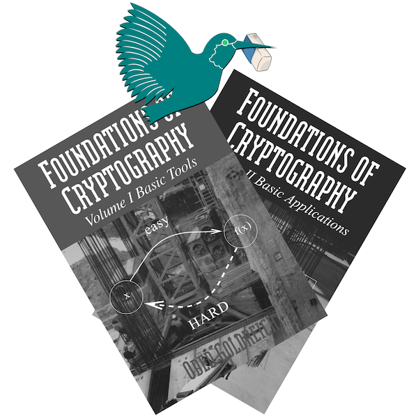

# The Foundations of Cryptography’s "LaTeX-ized" ERRATA

Errata from the Oded Goldreich's two volumes companion web pages ([https://www.wisdom.weizmann.ac.il/~oded/foc-vol1.html#err](https://www.wisdom.weizmann.ac.il/~oded/foc-vol1.html#err) and [https://www.wisdom.weizmann.ac.il/~oded/foc-vol2.html#err](https://www.wisdom.weizmann.ac.il/~oded/foc-vol2.html#err)) edited in a [LaTeX](https://github.com/baro77/FoC-LaTeXized-ERRATA/blob/main/foc-latexized-errata.pdf) document ([PDF](https://github.com/baro77/FoC-LaTeXized-ERRATA/blob/main/foc-latexized-errata.pdf) also provided).
